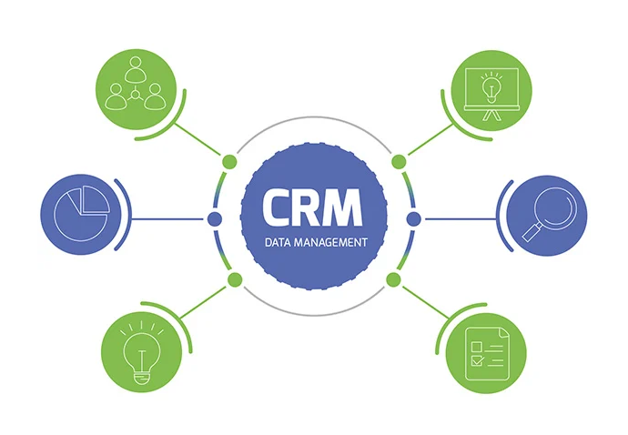

# CRM Data Analytics

Using CRM Sales data to create a segmenrtation model using RFM (Recency, Frequency, Monetary) analysis in marketing and customer relationship management to segment customers based on their transactional behavior.

Performed Customer Cohort Retention Analysis in Tableau for finding out customer churt and retention rate.

[Link to Dashboard](https://public.tableau.com/app/profile/sagar.paryani/viz/Customer-Cohort-Analysis/Dashboard1?publish=yes)